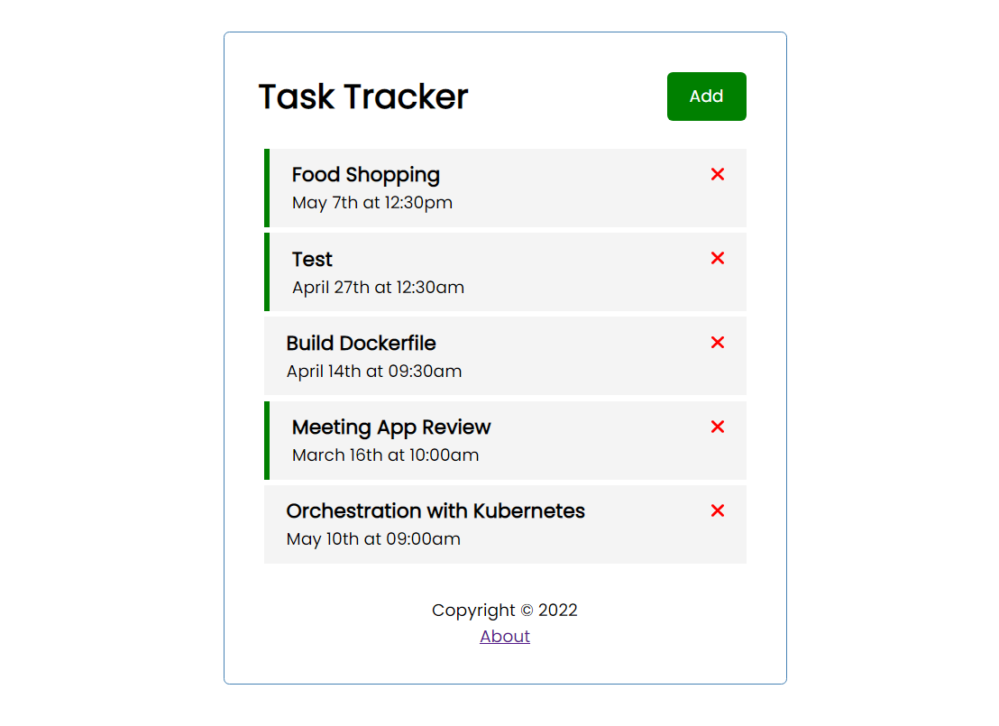
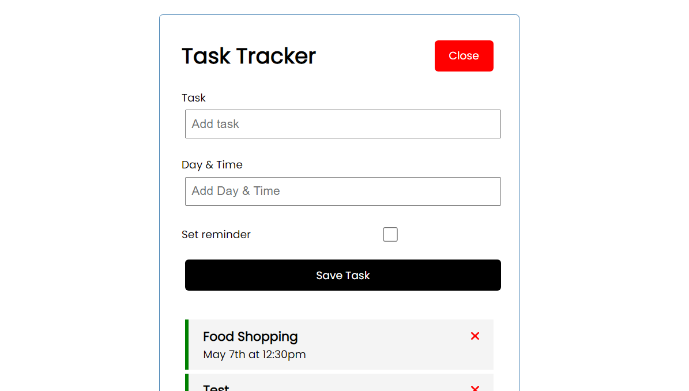

# Task Tracker

> Start angular app

```shell
ng serve
```

## About

- [ ] [json-server](https://www.npmjs.com/package/json-server) : backend extension used
- [ ] [angular-crash](https://github.com/arthking17/angular-labs/tree/main/Angular/angular-crash) : frontend app with ***Angular*** & ***Typescript***





## Plan

- [ ] Components
- [ ] Create component with angular-cli

```shell
ng g c course
```

- [ ] Template
- [ ] Interpolation
- [ ] Directives

> change the apparance or behavior of DOM elements and Angular components with attribute directives.
> they usually going to be curly braces "[]".

- [ ] Services
- [ ] Dependency Injection (*providers* in app.module.ts)
- [ ] Generate service with angular-cli

```shell
ng g s email
```

- [ ] ***Observable***

> We need to subscribe to an observable to get his value

- [ ] Class ***Subject***
