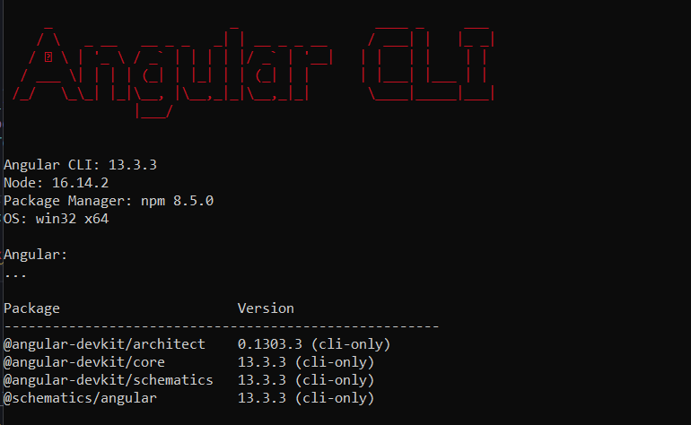
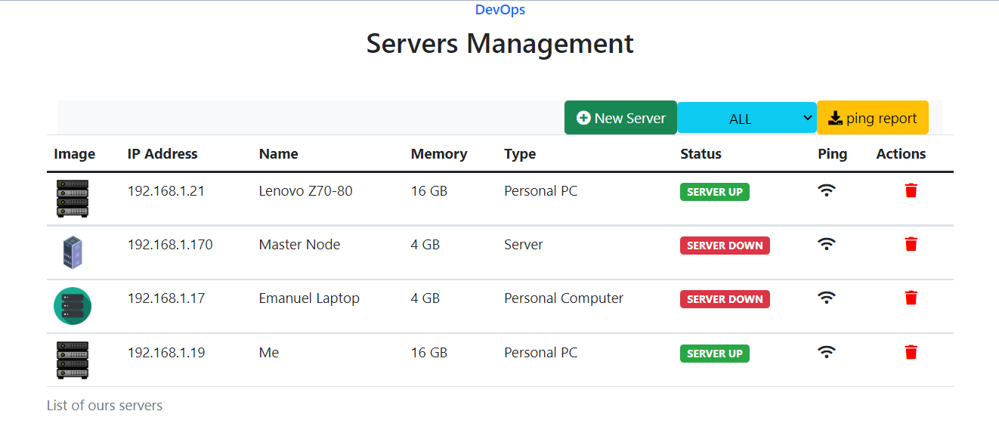

# Angular Labs
Build ***Angular*** project for learning purpose 🔥

- [ ] Check verion of *Angular*, nodejs and npm
```
ng --version
```


- [ ] Manage Server ( Spring Boot + *Angular* )
. Spring boot : project name *server*
. Angular : project name *serverapp*

